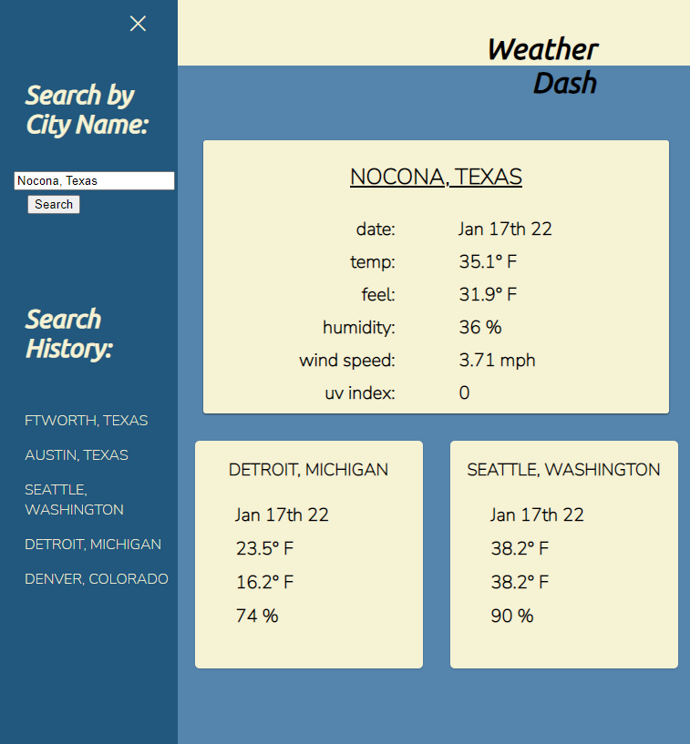
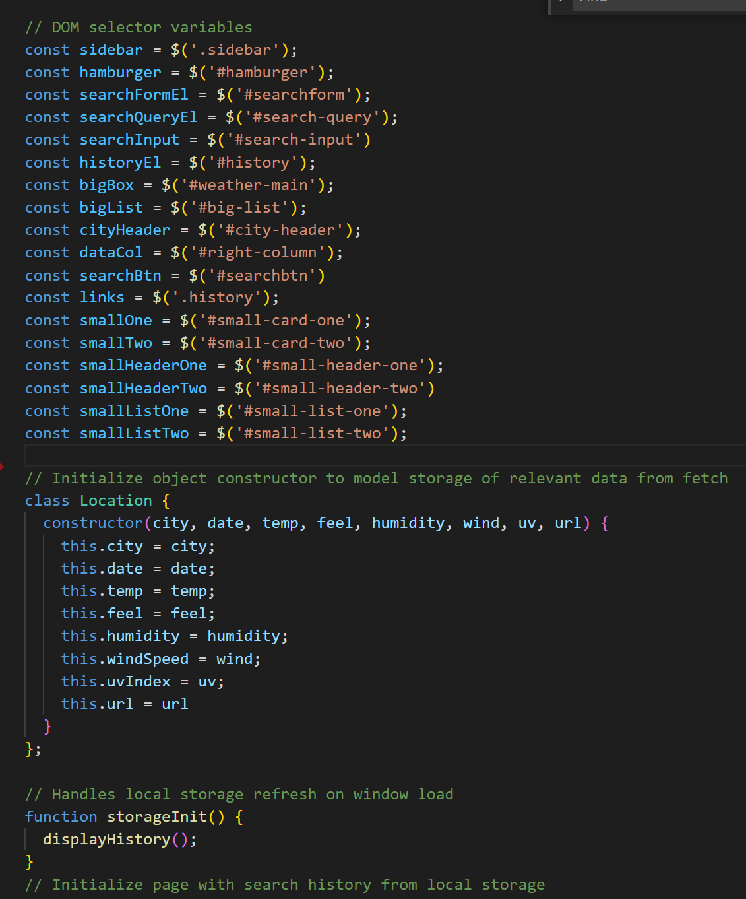

#   🌦️ *Weather-Dash* ☀️

### A strapping, dashing weatherboard 
> **||Weather-Dash||** 
 
### *DESCRIPTION* 
> Weather-Dash is great for anyone who makes trip back and forth between remote and networked locations!
>  
>>>  
___  

## *Table of Contents*
### (*Internal navigation links*)
- [Usage](#usage)
- [Features](#features)
- [Credits](#credits)
- [Live](#live)

> *Note: The click-through links contained within the discussion sections may send you to an external site.*  
___  
___
___
> - ### **USAGE**
>>>  *Grabbing a byte*  
>>>>  - Search for weather information in the collapsible sidebar input field.
>>>>  - Enter the city name and name of state, separated by a comma and space:  
>>>>>>  -     <example>Dallas, Texas</example>
>>>>  - Click the search button to initiate a fetch to the Mapbox and OpenWeather APIs. 
>>>>  - That's it!  View the results of your search in the large box.  
>>>>  - Upon sequential visits, the smaller boxes will populate with results from your search history!
___  
>>>> 
___  
___
___  
> - ### **FEATURES**
>>>  *Under the Hood*  
>>>> - JavaScript utilizes local storage to provide data persistence both online and off.
>>>> - Implements Mapbox API for coordinates.
>>>> - Implements OpenWeather API for absolutely current weather results.
>>>> - Uses jquery to manipulate and traverse the DOM.  
___  
>>>> 
___  
___
___  
> - ### **CREDITS**
>>>  *Contributions |&&| Honorable Mentions*    
>>>>  
>>>>  [OpenWeather API](https://openweathermap.org/api)  
>>>>  [Mapbox API](https://docs.mapbox.com/api/overview/)
>>>>  
___  
___
___  
> - ### **LIVE**
>>>  *The App in its natural state*  
>>>>  [WeatherDash Deployed](https://jaynewdee.github.io/Weather-Dash/)
___  
___
___  

## About the Creator

> ### *Joshua Newell Diehl*
>>>  
>>> is a budding developer currently based in Ft Worth, Texas.  He enjoys coding, long romantic hours dead asleep, walks with his dog Margot, and *creepily* referring to himself in third person.  
>>>>  
>>>> Here are a few of his favorite technologies at the moment:
>>>> - [Tailwind.css](https://tailwindcss.com/)
>>>> - [React.js](https://reactjs.org/)  
>>>> - [MongoDB](https://www.mongodb.com/)  
>>>> - [Express.js](https://expressjs.com/)

>>>>  
>>  
>>> And here is where you can reach him [||](https://developer.mozilla.org/en-US/docs/Web/JavaScript/Reference/Operators/Logical_OR 'Javascript OR Operator') review the work he's been doing:   
>>>
>>> [GitHub](https://github.com/JaynewDee 'Repositories authored by Joshua Newell Diehl')  
>>> [Email](mailto:jdiehl2236@gmail.com)  
>>> [Portfolio](https://jaynewdee.github.io/Personal-Portfolio-Bluev2/)
>>>
>>>> ~ *Let's build something awesome.*
